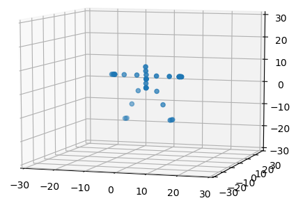
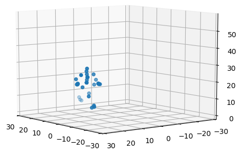

# npybvh
Python 3 module for reading Biovision Hierarchy (BVH) files and convert keyframes to poses.

# Features
- Read Biovision Hierarchy files
- Extract skeleton information (joint hierarchy)
- Calculate full pose for all keyframes in numpy format
- Display skeleton
- Display pose at any keyframe
- Display full animation





# How to use
```python
anim = Bvh()
anim.parse_file('example.bvh')
# get position at frame 11
positions, rotations = anim.frame_pose(11)

# get name of joints in order of appearance in array
joint_names = anim.joint_names()

# plot frame 11
anim.plot_frame(11)
```

# Acknowledgements
Thanks to Carnegie Mellon University for their [free motion capture database](http://mocap.cs.cmu.edu/) which is also available in [bvh format](https://sites.google.com/a/cgspeed.com/cgspeed/motion-capture/cmu-bvh-conversion).

# Contribute
If you find bugs or miss features, please contribute! (or use issues tab :-))
